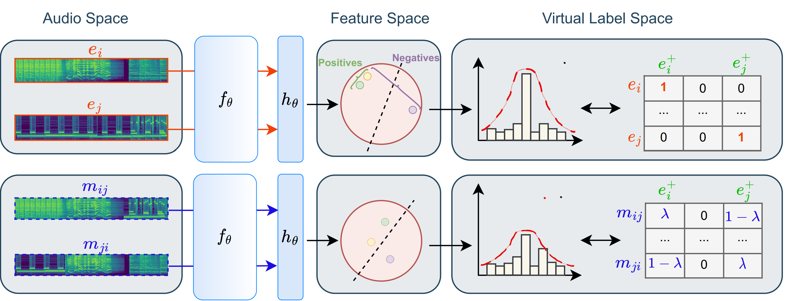

# uaMix-MAE: EFFICIENT TUNING OF PRETRAINED AUDIO TRANSFORMERS WITH UNSUPERVISED AUDIO MIXTURES ([paper](https://arxiv.org/abs/2403.09579))

This is the official implementation of [uaMix-MAE: Efficient Tuning of Pretrained Audio Transformers with Unsupervised Audio Mixtures](https://ieeexplore.ieee.org/abstract/document/10446342) by [Afrina Tabassum](https://sites.google.com/vt.edu/afrinatabassum/home) (Virginia Tech), [Dung Tran](https://www.microsoft.com/applied-sciences/people/dung-tran) (Microsoft Applied Sciences Group), [Trung Dang](https://www.microsoft.com/applied-sciences/people/trung-dang) (Microsoft Applied Sciences Group), [Ismini Lourentzou](https://isminoula.github.io/) (University of Illinois Urbana - Champaign), [Kazuhito Koishida](https://www.microsoft.com/applied-sciences/people/kazuhito-koishida) (Microsoft Applied Sciences Group).

# Code
Comming soon.....

# Description
This paper proposes uaMix-MAE, an efficient ID tuning strategy that leverages unsupervised audio mixtures. Utilizing contrastive tuning, uaMix-MAE aligns the representations of pretrained MAEs, thereby facilitating effective adaptation to task-specific semantics. To optimize the model with small amounts of unlabeled data, we propose an audio mixing technique that manipulates audio samples in both input and virtual label spaces. Experiments in low/few-shot settings demonstrate that uaMix-MAE achieves 4-6% accuracy improvements over various benchmarks when tuned with limited unlabeled data, such as AudioSet-20K.


## Citation

If you find this method and/or code useful, please consider citing:
```
@inproceedings{tabassum2024uamixmae,
  title = {uaMix-MAE: Efficient Tuning of Pretrained Audio Transformers with Unsupervised Audio Mixtures},
  author = {Afrina Tabassum$,Dung Tran, Trung Dang, Ismini Lourentzou, Kazuhito Koishida},
  booktitle = {IEEE International Conference on Acoustics, Speech and Signal Processing (ICASSP)},
  year = {2024}
}
```
